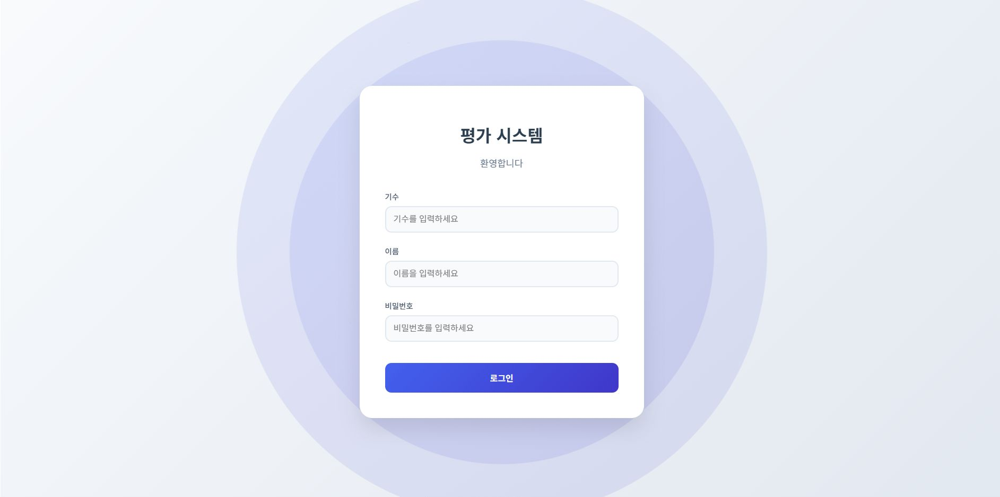
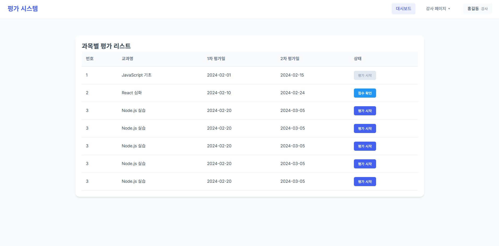
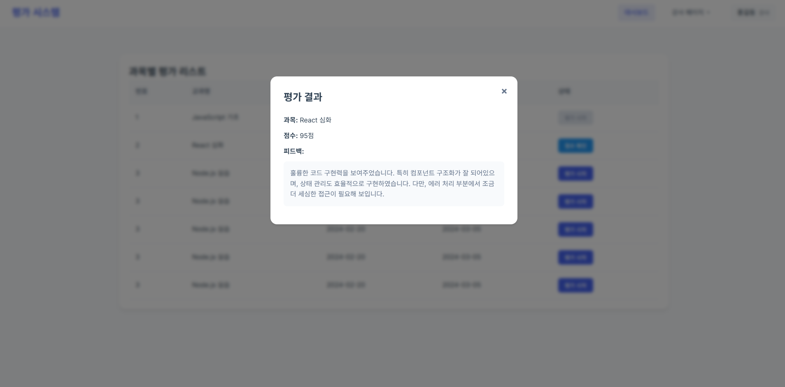
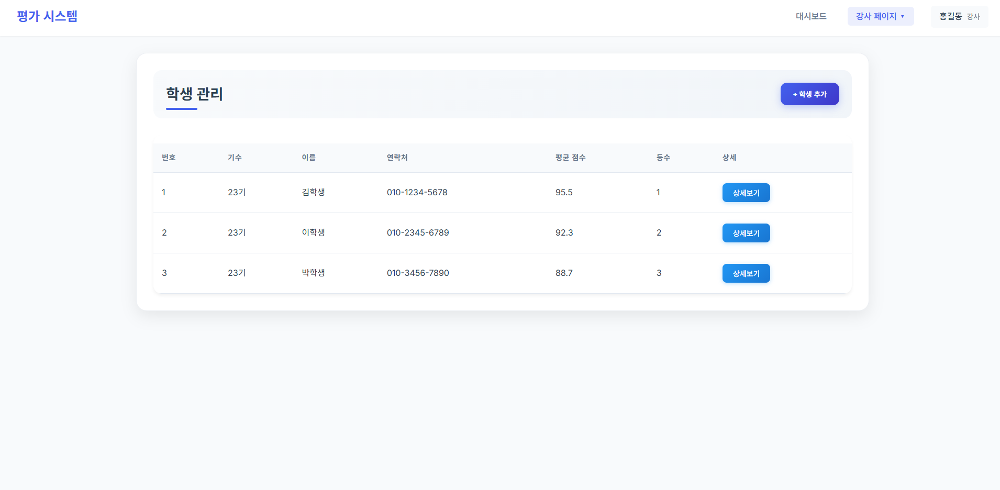
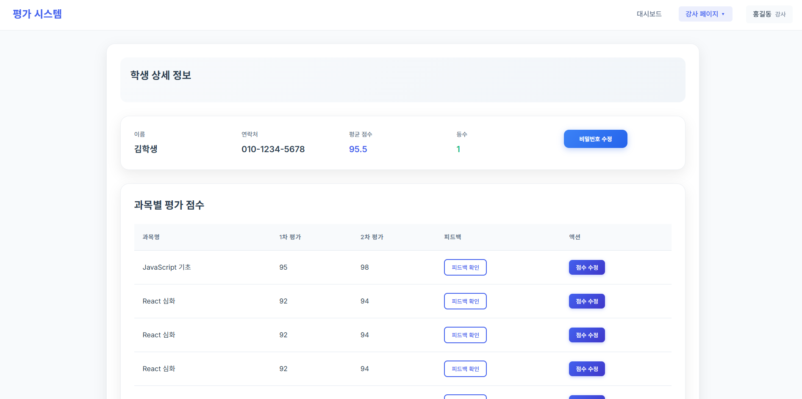
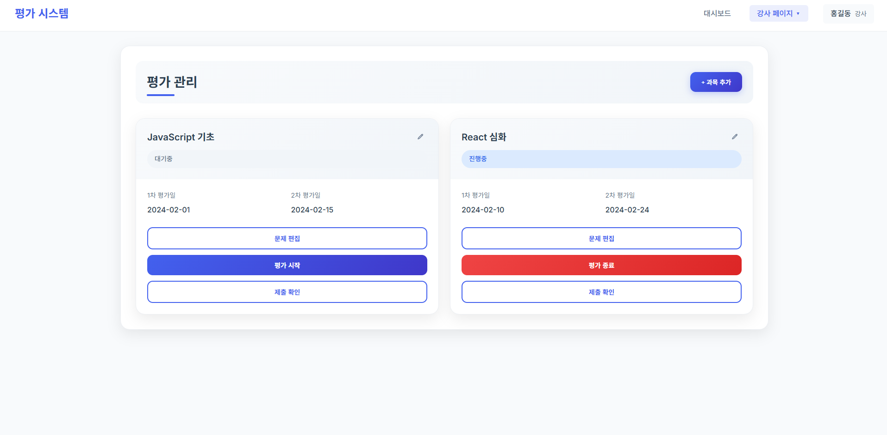
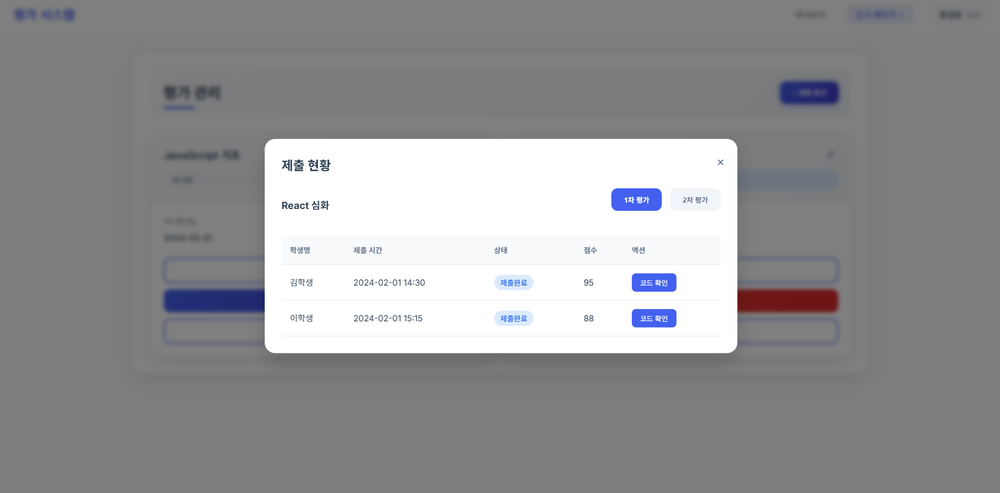
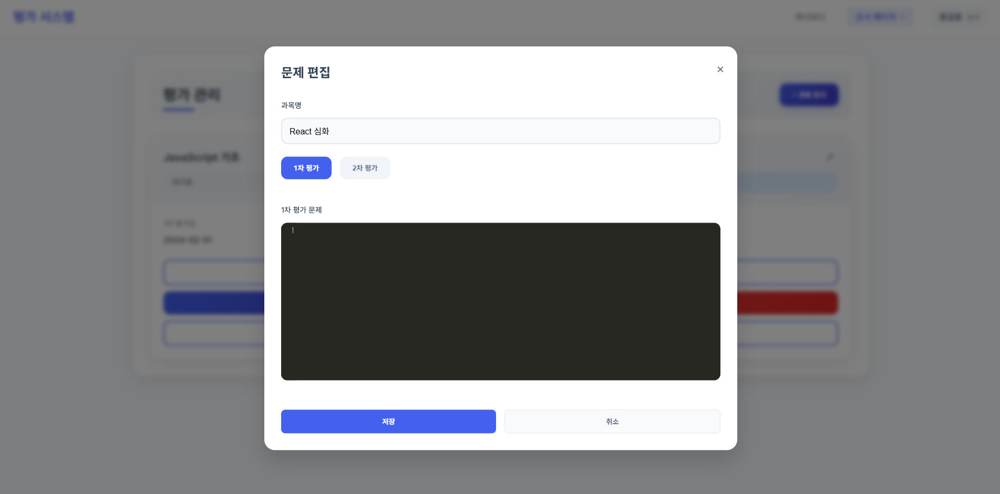

# 🧪 평가 시스템 (Thymeleaf + Spring Boot)


[](https://openjdk.org/projects/jdk/17/)
[](https://spring.io/projects/spring-boot)
[](https://gradle.org/)
[](./src/test)

학생과 강사가 사용하는 실시간 코딩 평가 시스템입니다.  
과목별 평가 문제 등록, 시험 시작/종료, 코드 채점 및 피드백 기능을 제공합니다.

---

## 🚀 시작 방법 (Getting Started)

### 1. Java 17 설치
```bash
java -version
```

### 2. 프로젝트 클론
```bash
git clone https://github.com/사용자명/프로젝트명.git
cd 프로젝트명
```

### 3. 빌드 및 실행
```bash
./gradlew bootRun
```

### 4. 테스트 계정
```bash
1. 강사 계정
  - 0기, 김재섭, qwer1234!
2. 학생 계정
  - 15기, 이은하, qwer1234!
```
> 기본 실행 포트: `http://localhost`

---

## 🗃️ 데이터베이스 초기화

앱 실행 시 다음 SQL 파일이 자동 실행됩니다:

- `src/main/resources/db/schema.sql` – 테이블 구조 생성
- `src/main/resources/db/data.sql` – 기본 학생/과목/평가 데이터 입력

```properties
spring.sql.init.mode=always
spring.sql.init.schema-locations=classpath:db/schema.sql
spring.sql.init.data-locations=classpath:db/data.sql
```

---

## 🧩 주요 기능 요약

- 학생 및 강사 구분 로그인
- 과목별 평가 문제 목록 확인 및 응시
- 코드 작성 및 제출 기능 (CodeMirror 기반)
- 강사 채점 및 피드백 입력, 점수 팝업
- 학생별 점수 및 피드백 조회
- 평균 점수 그래프 시각화
- 학생 관리 (추가, 수정, 삭제)

---

## 👥 사용자 흐름 요약

- 학생은 로그인 후 과목별 평가를 응시하고 코드를 작성하여 제출할 수 있습니다.
- 강사는 문제 출제, 평가 시작/종료, 학생 코드 채점 및 피드백 작성이 가능합니다.
- 채점이 완료되면 학생은 해당 과목에 대한 점수와 피드백을 확인할 수 있습니다.

---

## 📸 주요 화면 미리보기

| 로그인 | 대시보드 | 대시보드 모달 | 학생 리스트 |
|--------|----------|--------------|------------|
|  |  |  |  |

| 학생 상세보기 | 평가 페이지 | 제출 확인 | 문제 편집 |
|--------|----------|--------------|------------|
|  |  |  |  |

---

## 📁 프로젝트 구조 및 구성 설명

```
nirsa-exam-project/
├── build.gradle, settings.gradle             # Gradle 의존성 및 프로젝트 설정
├── gradlew, gradlew.bat                      # Gradle Wrapper 실행 파일
├── .gitignore, HELP.md                       # Git 설정 및 Spring 기본 문서
├── src/
│   ├── main/
│   │   ├── java/com/tes/
│   │   │   ├── application                   # 애플리케이션 시작 클래스
│   │   │   ├── global/                       # 공통 설정 및 예외 처리
│   │   │   └── domain/                       # 도메인 (사용자, 과목, 평가 등)
│   │   │       ├── controller/               # HTTP 요청 처리
│   │   │       ├── service/                  # 비즈니스 로직
│   │   │       ├── domain/
│   │   │       │   ├── entity/               # JPA 엔티티
│   │   │       │   └── repository/           # 데이터 접근 계층
│   │   │       └── model/
│   │   │           ├── request/              # 요청 DTO
│   │   │           └── response/             # 응답 DTO
│   │   └── resources/
│   │       ├── application.properties        # 애플리케이션 설정
│   │       ├── db/                           # schema.sql, data.sql
│   │       ├── static/                       # CSS, JS
│   │       └── templates/                    # Thymeleaf 템플릿
├── test/
│   └── java/com/tes/                         # 단위 테스트 클래스
```

---

## 🛠 기술 스택

| 구분 | 기술 |
|------|------|
| Language | Java 17 |
| Build Tool | Gradle, Gradle Wrapper |
| Backend Framework | Spring Boot 3.4.5 |
| Template Engine | Thymeleaf + Thymeleaf Layout Dialect |
| ORM / Database | Spring Data JPA, H2 Database |
| Validation | Jakarta Bean Validation |
| Security | Spring Security Core (세션 기반 인증) |
| Logging | Log4j2 |
| Annotation Processor | Lombok |
| Testing | JUnit 5, MockMvc, Mockito, Spring Boot Test |
| Frontend | HTML, CSS, JavaScript, CodeMirror |

---

## ✅ 테스트 실행 방법

```bash
./gradlew test
```

- `MemberControllerTest` 포함
- 향후 서비스 및 통합 테스트 확장 예정

---

## 🧾 향후 계획 (Roadmap)
- [ ] 미완성 기능 구현
- [ ] 제출 코드 자동 채점 룰 개선(LLM)
- [ ] 평가 결과 통계 시각화 (과목별 평균, 편차)
- [ ] 평가 결과 문자, 이메일 전송
- [ ] 다국어 지원 (i18n)
- [ ] REST API 분리 및 React, Vue 프론트 개발

---

## 🙋‍♀️ 기여하기

이 프로젝트에 기여하고 싶다면 PR 또는 Issue를 통해 의견 주세요.

## 📜 라이선스

MIT License © 2025 KoreaNirsa

## 📬 연락처
- 이메일: [islandtim@naver.com](islandtim@naver.com)
- 블로그: [https://nirsa.tistory.com](https://nirsa.tistory.com)
- 깃허브: [https://github.com/KoreaNirsa](https://github.com/KoreaNirsa)
